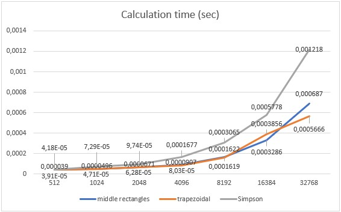
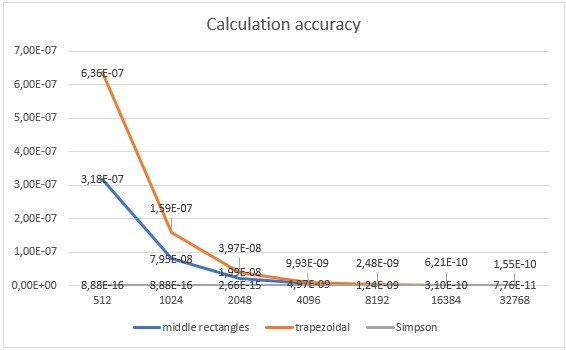

# Several demo programs with MPI
MPI is a directory of C++ programs which illustrate the use of the Message Passing Interface for parallel programming. MPI allows a user to write a program in a familiar language, such as C, C++, FORTRAN, or Python, and carry out a computation in parallel on an arbitrary number of cooperating computers.  

Function "Ring": 
- 0 --> 1, 1 --> 2, 2 --> 3 and etc. --> 1;
- it repeats optional amount of times;
- using the Point-To-Point or the Collective communication pattern;
- prints final values on threads and then sum them up (with the Collective pattern).

Multiplication:
- complex matrix multiplication;
- multiplication of long numbers by the Karatsuba method;
- multiplication of long numbers by the Schonhage-Strassen multiplication method.  

Calculating Pi:
- the quadrature formula of middle rectangles;
- the trapezoidal quadrature formula;
- Simpson's quadrature formula.
##

##

